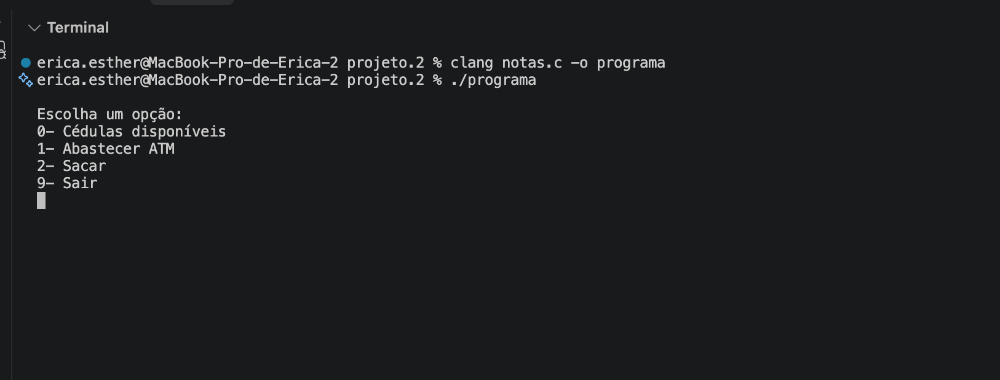
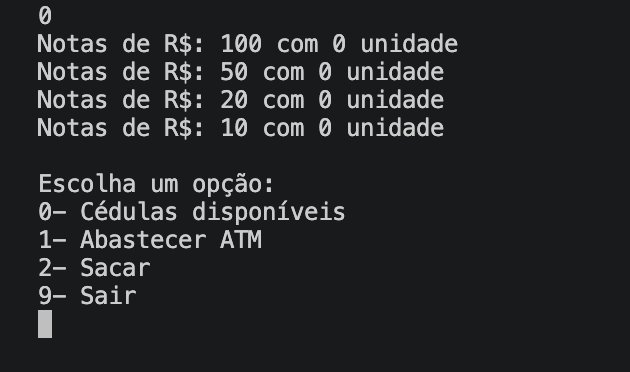
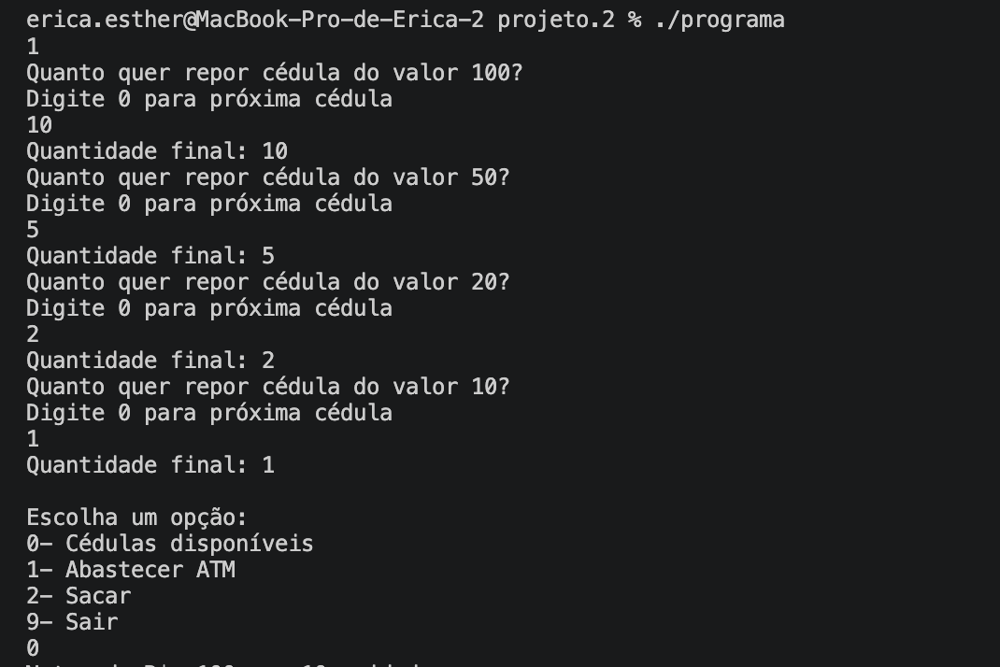
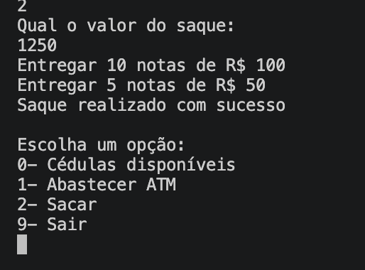
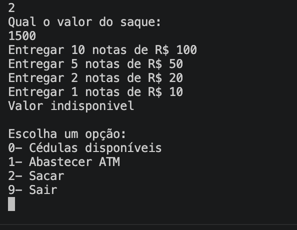
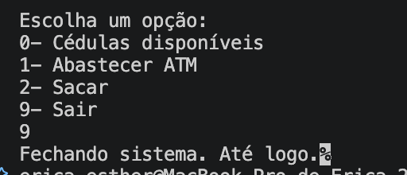

# Caixa Eletrônico em C

Simulação simples de um caixa eletrônico (ATM) via terminal, feita em C. O sistema controla o estoque de cédulas de R$ 100, R$ 50, R$ 20 e R$ 10, permitindo abastecer o caixa e realizar saques com um algoritmo guloso (greedy) que escolhe as maiores cédulas primeiro.

## Funcionalidades

- **Consultar cédulas disponíveis**: mostra a quantidade de notas de cada valor no caixa.
- **Abastecer o caixa**: adiciona novas cédulas ao estoque, valor por valor.
- **Sacar**: informa um valor e o sistema calcula a melhor combinação de cédulas para entregar, ou avisa quando o saque não é possível com as notas disponíveis.
- **Sair**: encerra o programa.

## Como funciona

O caixa começa vazio (0 cédulas de cada valor). O menu principal oferece 4 opções:

```
0 - Cédulas disponíveis
1 - Abastecer ATM
2 - Sacar
9 - Sair
```

No saque, o programa percorre as cédulas da maior (R$ 100) para a menor (R$ 10), usando o máximo de notas possível de cada valor sem ultrapassar o saldo em estoque. Se sobrar valor sem conseguir formar com as notas disponíveis, o saque é recusado e nada é debitado do estoque.

## Como executar

```bash
gcc notas.c -o caixa
./caixa
```

## Estrutura do projeto

```
.
├── notas.c        # código-fonte principal
└── prints/        # screenshots do sistema em execução
```

## Screenshots

| Menu principal | Cédulas disponíveis |
|---|---|
|  |  |

| Abastecendo o caixa | Saque disponível |
|---|---|
|  |  |

| Saque indisponível | Fechando o sistema |
|---|---|
|  |  |

## Autora

Érica Esther Santana — estudante de Ciência da Computação, em busca de estágio em desenvolvimento de software.
[LinkedIn](https://linkedin.com/in/esther-santana)
